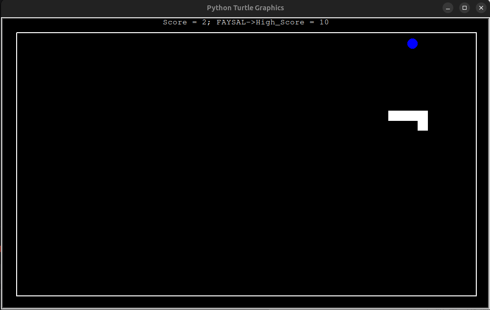

# Snake-Game-Python
)

# 🐍

A classic Snake game implementation with high score tracking using Python Turtle graphics!

## Files

- `main.py` - Main game loop and setup
- `create_snake.py` - Snake movement and growth
- `food.py` - Food generation and placement
- `scoreboard.py` - Score tracking and high scores
- `data.txt` - Stores high score
- `name.txt` - Stores high score holder's name

## How to Play

- Use **Arrow Keys** to control the snake
- Eat blue food to grow and increase score
- Avoid hitting walls or your own tail
- Try to beat the high score!

## Features

- **Smooth Controls**: Responsive directional movement
- **Growing Mechanism**: Snake extends when eating food
- **Score Tracking**: Current score display
- **High Score System**: Persistent high score storage
- **Name Recording**: Winner's name saved with high score
- **Boundary Detection**: Game area with visible borders
- **Collision Detection**: Wall and self-collision

##  Game Objects

### Snake
- Starts with 3 segments
- Moves continuously
- Grows when eating food
- Cannot reverse direction

### Food
- Blue circles
- Randomly placed within boundaries
- New position after being eaten

### Scoreboard
- Current score
- High score with holder's name
- Game over message
- Congratulations for new record

## Quick Start

```bash
python main.py
```

## Controls

```
Key	Action
↑	Move Up
↓	Move Down
←	Move Left
→	Move Right
```